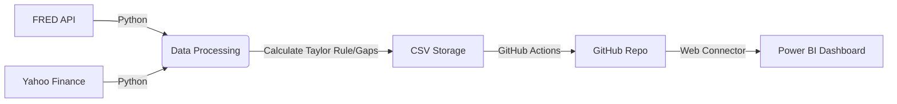
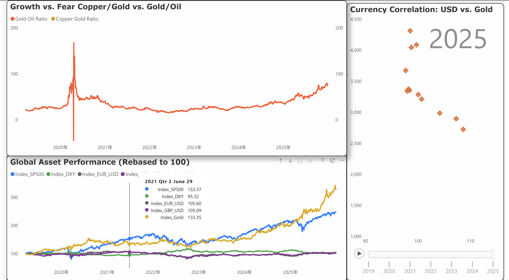

# 🌍 Automated Global Macroeconomic Dashboard


> **Live Status**: Data is automatically updated daily at 00:00 UTC via GitHub Actions.


## 📖 Project Overview
This project is an **end-to-end automated data pipeline**  designed to monitor the global economic cycle, assess Federal Reserve policy stance, and identify market inflection points. 

Unlike standard dashboards that only display raw prices, this system integrates **financial modeling logic** (e.g., Taylor Rule, Output Gap, Liquidity Spreads) to provide actionable insights into **"Where are we in the economic cycle?"**

The ETL process runs daily via **GitHub Actions**, fetching data from FRED and Yahoo Finance, processing it via **Python**, and feeding a 4-page interactive **Power BI** report.


## 📂 Project Structure

```text
├── .github/workflows/
│   └── daily_update.yml   # CI/CD Automation scripts (Daily Update)
├── data/                  # Stores processed CSV files (Source for Power BI)
│   ├── macro_data.csv
│   └── market_data.csv
├── dashboard/
│   ├── Global_Macro.pbix  # Power BI (.pbix) Project File
│   └── screenshots/       # Images for README
├── src/
│   └── etl_script.py      # Python ETL source code
├── requirements.txt       # Python dependencies
└── README.md              # Documentation
```


### Automation (CI/CD)
* **GitHub Actions** runs the ETL script daily.
* The workflow (`daily_update.yml`) manages Python dependencies, API keys (via Secrets), and auto-commits the new data.




  ## ⚙️ Technical Architecture

This project operates as a full-stack data analytics solution, utilizing a **Serverless Architecture** where the GitHub repository functions as a "Headless CMS" for the Power BI dashboard.

### 1. Data Pipeline (ETL)
The Python script (`etl_script.py`) executes a robust **Extract, Transform, Load** workflow:

* **Extract (Data Ingestion)**
    * **Macro Data**: Automated API calls to **FRED** (Federal Reserve Economic Data) for GDP, CPI, Unemployment, and Yields.
    * **Market Data**: Uses `yfinance` to fetch real-time data for Equities (SPX), Commodities (Gold, Oil), and Currencies.

* **Transform (Financial Engineering)**
    * **Time-Series Alignment**: Resamples and harmonizes disparate data frequencies (Daily vs. Monthly vs. Quarterly).
    * **Imputation**: Handles missing data points (e.g., non-trading days) using **Forward Fill (ffill)** logic.
    * **Feature Engineering**:
        * **Taylor Rule**: Calculates the theoretical "Optimal" Fed Funds Rate based on inflation and output gaps.
        * **Recession Signals**: Computes the **Sahm Rule** and **10Y-2Y Yield Curve** spreads.
        * **Growth Metrics**: Calculates Year-over-Year (YoY) growth rates and Real Interest Rates.

* **Load (Storage)**
    * Processed datasets are exported as clean `.csv` files to the `data/` directory.
    * These files serve as the single source of truth for the visualization layer.

### 2. Automation (CI/CD)
The system is fully automated using **GitHub Actions** (`.github/workflows/daily_update.yml`):

* **Trigger**: A Cron job (`0 0 * * *`) executes the pipeline daily at **00:00 UTC**.
* **Security**: API keys are securely managed via **GitHub Secrets**.
* **Auto-Commit**: The workflow automatically pushes updated CSV files back to the repository.
* **Hosting**: The repo provides raw data access via **GitHub Raw URLs**, effectively acting as a free, high-availability database.

### 3. Visualization (Power BI)
* **Data Connection**: Connected via `Web.Contents` to the GitHub Raw CSV URLs. This allows the report to update automatically anywhere with internet access, without needing local file paths.
* **Data Modeling**:
    * Implemented a **Star Schema** with a central `Date_Table` connecting `Fact_Market` and `Fact_Macro` tables.
* **Advanced Analytics (DAX)**:
    * **Dynamic Time Intelligence**: Measures for YTD performance and custom time-frames.
    * **Logic Gates**: `SWITCH` functions to control heatmap coloring (e.g., Green for Growth, Red for Contraction).
* **UI/UX**: Designed with a "Bloomberg Terminal" aesthetic using a custom JSON theme.

---

## Stack

* **Language**: Python 3.14+
* **Libraries**: `pandas`, `numpy`, `yfinance`, `fredapi`
* **Automation**: GitHub Actions (YAML)
* **Visualization**: Microsoft Power BI (DAX, Power Query)
* **Data Format**: CSV (Comma Separated Values)

---

##  How to Use This Dashboard

1.  **Time Travel (Slicers)**
    * Use the **"Duration"** slicer (top right) to filter specific historical periods. Isolate events like the *2008 GFC* or *2020 COVID Crash* to see how metrics behaved during crises.

2.  **Drill-Down Analysis**
    * **Scatter Plots (Page 4)**: Hover over any data point to reveal the specific date and exact asset price values.
    * **Heatmaps (Page 3)**: The color intensity represents the severity of the trend (Standard Deviation).

3.  **Cross-Filtering**
    * Click on a specific **Indicator Name** in the Heatmap matrix to filter the line charts below it. This allows you to isolate the trend of a single metric (e.g., "Industrial Production") against the broader context.


##  Dashboard Previews

| **Page 1: Market Overview** | **Page 2: Fed Policy Monitor** |
|:---:|:---:|
|  |  |
| *Valuation Heatmaps & Yield Curve* | *Taylor Rule, Real Rates & Liquidity* |

| **Page 3: Business Cycle (Risk)** | **Page 4: Cross-Asset Strategy** |
|:---:|:---:|
|  |  |
| *Leading Economic Indicators (LEI)* | *Copper/Gold Ratio & Global Sentiment* |

> **Note:** For the full interactive experience, please download the `.pbix` file from the [`dashboard/`](dashboard/) folder.

---


## 🧠 Financial Logic & Dashboard Architecture

The solution is architected into four logical modules, mirroring a professional **Top-Down Investment Framework**. The dashboard is structured to answer one core question:

> **"Where are we in the business cycle?"**


# 📊 Page 1: Market Overview – Valuation & Sentiment

**Objective:**
Real-time monitoring of asset performance and market sentiment to answer the core question: **Is the market overheated or oversold?**

**Key Metrics Tracked:**
* **Equities:** S&P 500, Nasdaq
* **Macro/Commodities:** DXY (Dollar Index), Gold, Oil, 10Y US Treasury Yield
* **Sentiment:** VIX (Fear Gauge)


## 1.1 Valuation Model: 200MA Heatmap
**Logic:** This model utilizes **Mean Reversion** theory. It calculates the deviation of current prices from their long-term trend (200-day Moving Average). Prices rarely deviate too far from their long-term trend without eventually reverting.

### **The Formula (Trend Bias)**
> `Bias = (Current Price - 200MA) / 200MA`

### **Visual Highlight**
A dynamic **"Valuation Heat"** chart that identifies conditions using standard deviation bands.

### **💡 How to Interpret (Signals)**
* **<span style="color:red">🔴 Overheated (Red)</span>**
    * **Threshold:** Deviation is **> +15%** above the 200MA.
    * **Implication:** The market is extended. High risk of mean reversion (correction).
* **<span style="color:green">🟢 Oversold (Green)</span>**
    * **Threshold:** Deviation is significantly below the 200MA (e.g., **< -15%**).
    * **Implication:** The asset is undervalued relative to its trend. Potential buying opportunity.


## 1.2 Macro Analysis: Yield Curve
**Logic:** Analyzes the spread between the **10-Year** and **2-Year** US Treasury Yields to predict looming economic downturns.

* **Metric:** `10Y Yield - 2Y Yield`
* **Signal:** **Inversion (Negative Spread)**.
* **Historical Reliability:** An inverted yield curve has historically been the most reliable leading indicator of a recession occurring within the next **12–18 months**.


## 1.3 Market Sentiment: VIX Fear Gauge
**Logic:** Uses the VIX as a **Contrarian Indicator**. It monitors volatility levels relative to S&P 500 performance to spot panic-selling opportunities or market tops.

### **💡 How to Interpret**
* **Extreme Fear (Capitulation): VIX > 30**
    * **Implication:** Indicates panic selling. Spikes above 30 often correlate with **market bottoms**. This is often a signal to look for buying opportunities ("Be greedy when others are fearful").
* **Complacency: VIX < 15**
    * **Implication:** Indicates a lack of fear and high complacency. Prolonged periods at these levels may precede a volatility spike or market correction.


---


# 🏦 Page 2: Monetary Policy Monitor & Liquidity (The "Why")

**Objective:**
Assess the stance of the Federal Reserve and liquidity conditions to answer the critical question: **Is the Fed "Behind the Curve"?**

**Goal:**
Determine if monetary policy is **Restrictive** (slowing growth/recessionary) or **Accommodative** (fueling inflation).

**Key Metrics:**
* Fed Funds Rate (FFR)
* Real Interest Rates
* M2 Money Supply
* Core PCE Inflation


## 2.1 Analytical Model: The Taylor Rule
**Logic:** A gap analysis comparing the *Actual Fed Funds Rate* vs. the *Theoretical "Optimal" Rate* to identify policy errors.

### **The Formula**
$$R = \pi + r^* + 0.5(\pi - \pi^*) + 0.5(y - y^*)$$

* **$\pi$ (Inflation):** Core PCE (Personal Consumption Expenditures).
* **$r^*$ (Neutral Rate):** Assumed real equilibrium interest rate.
* **$\pi^*$ (Target Inflation):** Fed's target (usually 2%).
* **$y - y^*$ (Output Gap):** Difference between Real GDP and Potential GDP.


### **💡 How to Interpret (Policy Gap)**
* **Accommodative / Loose (Fed Rate < Taylor Rate)**
    * **Signal:** The Fed is keeping rates too low relative to economic conditions.
    * **Risk:** "Behind the curve" on fighting inflation (Inflationary Risk).
* **Restrictive / Tight (Fed Rate > Taylor Rate)**
    * **Signal:** The Fed is keeping rates higher than what economic conditions suggest.
    * **Risk:** Overtightening leading to a slowdown (Recession Risk).


## 2.2 Metric: Real Interest Rate
**Logic:** Measures the true cost of borrowing by adjusting for inflation. It determines if policy is actually "biting" the economy.

### **The Formula**
> `Real Rate = Nominal Fed Funds Rate - Core PCE Inflation`


### **💡 How to Interpret**
* **Positive Real Rate (+):**
    * **Signal:** Financing costs are higher than inflation.
    * **Impact:** Restricts the economy (cools demand). Required to fight inflation.
* **Negative Real Rate (-):**
    * **Signal:** Inflation is higher than financing costs.
    * **Impact:** Stimulates the economy (money is "cheap" in real terms).

---


# 📉 Page 3: Business Cycle Surveillance (The "Health Check")

**Objective:**
Identify inflection points in the economic cycle.

**Goal:**
Perform a "health check" on the underlying economy beyond stock prices to detect early warning signs of recession before they hit the headlines.

**Key Metrics Tracked:**
* **Labor Market:** Unemployment Rate, Jobless Claims
* **Production:** Industrial Production, New Orders (Manufacturing)
* **Consumption:** Retail Sales, Consumer Sentiment
* **Housing:** Building Permits


## 3.1 Recession Signal: The Sahm Rule
**Logic:** A highly accurate, real-time recession indicator based on the momentum of the unemployment rate, rather than just the absolute level.

### **The Formula**
> Triggers when the **3-month Moving Average** of the national unemployment rate rises by **0.50 percentage points** or more relative to its low during the previous **12 months**.


### **💡 How to Interpret**
* **Triggered (> 0.5%):** Historically marks the early stage of a recession with high accuracy.
* **Rapid Rise:** Indicates a deteriorating labor market where momentum is shifting toward job losses.


## 3.2 Leading Economic Indicators (LEI) Analysis
**Logic:** Uses a specific set of metrics that tend to change direction *before* the overall economy does.

### **Key Components**
1.  **Manufacturing (Business Confidence Proxy)**
    * **Metric:** New Orders for Non-defense Capital Goods (excl. Aircraft).
    * **Significance:** Proxies business CapEx investment. A Year-over-Year (YoY) decline often precedes an earnings recession.
2.  **Consumption (The Engine)**
    * **Metric:** Real Retail Sales & Consumer Sentiment.
    * **Significance:** Consumption drives ~70% of US GDP. A divergence between consumer sentiment (feeling) and actual sales (spending) is a key warning sign.
3.  **Housing (Early Warning)**
    * **Metric:** Building Permits.
    * **Significance:** Housing is sensitive to interest rates and often turns down first in the cycle.


## 3.3 Macro Risk Heatmap
**Visual Logic:** A "Barcode" visualization of leading indicators sorted by economic impact.

### **💡 How to Interpret (Landing Scenarios)**
* **Soft Landing (Mixed Signals):**
    * **Scenario:** Manufacturing (New Orders) turns <span style="color:red">**Red**</span> (contraction) while Services/Consumption remains <span style="color:green">**Green**</span> (expansion).
    * **Implication:** The industrial side is slowing, but the consumer is holding up the economy.
* **Hard Landing (Synchronized Downturn):**
    * **Scenario:** Both Manufacturing AND Services/Consumption turn <span style="color:red">**Red**</span>.
    * **Implication:** Broad-based economic contraction signaling a likely recession.
* **Inverted Yield Curve (Cross-Reference):**
    * **Signal:** If the heatmap is deteriorating AND the 10Y-2Y Yield Curve is inverted (< 0), the probability of recession is extremely high.


---

# ⚖️ Page 4: Cross-Asset Strategy (The "Action")

**Objective:**
Formulate data-driven investment strategies by identifying structural shifts in global capital flows.

**Goal:**
Verify if asset classes confirm the economic narrative.
* *Are stocks rising because of real growth or just liquidity?*
* *Is the market pricing in a recession even if earnings look good?*

**Key Metrics Tracked:**
* **Commodities:** Copper ("Dr. Copper"), Gold, Oil
* **Currencies:** DXY (Dollar Index)
* **Ratios:** Copper/Gold, Gold/Oil

---

## 4.1 Growth vs. Fear Model: The Copper/Gold Ratio
**Logic:** This ratio acts as the global "pulse." It compares the premier industrial metal (Cyclical Growth) against the premier safe-haven asset (Fear).

### **The Formula**
> `Ratio = Price of Copper / Price of Gold`

* **Copper:** Represents Industrial Demand and Global Growth.
* **Gold:** Represents Fear, Capital Preservation, and Hedge demand.


### **💡 How to Interpret**
* **Rising Ratio ↗ (Risk On):**
    * **Signal:** Copper is outperforming Gold.
    * **Implication:** The market is pricing in economic expansion and recovery.
* **Falling Ratio ↘ (Risk Off):**
    * **Signal:** Gold is outperforming Copper.
    * **Implication:** The market is pricing in a slowdown or recession (Flight to Safety).

### **⚠️ Critical Signal: The "Fake Rally" Divergence**
* **Scenario:** Stock Market (S&P 500) makes new highs **WHILE** the Copper/Gold Ratio is collapsing.
* **Implication:** The rally is likely driven by liquidity or speculation, not underlying economic growth. High risk of reversal.

---

## 4.2 Stagflation Monitor: Gold/Oil Ratio
**Logic:** Measures the relationship between fear (Gold) and energy demand (Oil).

### **💡 How to Interpret**
* **Rising Ratio:**
    * **Scenario:** Gold rising (Fear up) while Oil falling (Demand/Activity down).
    * **Implication:** Signals potential **Stagflation** (low growth + high inflation/fear) or Geopolitical Risk.

---

## 4.3 Liquidity & Currency Constraints
**Logic:** Analyzing the denominator of asset prices (The Dollar) and the fuel for asset prices (M2 Money Supply).

### **DXY (Dollar Index)**
* **Logic:** The Global Wrecking Ball.
* **Signal:** High inverse correlation with risk assets.
    * **Rising DXY:** Tightens global financial conditions (bad for emerging markets/stocks).
    * **Falling DXY:** Loosens conditions (boosts asset prices).

### **M2 Money Supply Correlations**
* **Logic:** Tracks the "fuel" in the system.
* **Observation:** Changes in M2 often lead asset price moves in sensitive sectors (Crypto, Tech Stocks) with a **Lag Effect**.


---


## 🛠️ Installation & Usage

### 1. Prerequisites
* **Python 3.14+**
* **FRED API Key**: Get a free API key from [St. Louis Fed (FRED)](https://fred.stlouisfed.org/docs/api/api_key.html).

### 2. Local Setup (Python ETL)

**Step 1: Clone the repository**

```bash
git clone [https://github.com/YourUsername/macro-economic-dashboard.git](https://github.com/YourUsername/macro-economic-dashboard.git)
cd macro-economic-dashboard
```

**Step 2: Install dependencies**
```bash
pip install -r requirements.txt
```

**Step 3: Set up API Key**
You can set the environment variable directly in your terminal or use a `.env` file.

* **Option A: Export via Terminal**
    ```bash
    # Linux / macOS
    export FRED_API_KEY='your_api_key_here'

    # Windows (PowerShell)
    $env:FRED_API_KEY='your_api_key_here'
    ```

* **Option B: Create a `.env` file (Recommended)**
    Create a file named `.env` in the root directory and add:
    ```env
    FRED_API_KEY=your_api_key_here
    ```

**Step 4: Run the ETL script**
This script fetches the latest data from FRED and Yahoo Finance, processes it, and saves it to the `data/` folder.

```bash
python src/etl_script.py
```
*Output: Processed CSV files will be generated in the `data/` directory.*

### 3. Power BI Setup
1.  Open the Power BI file: `dashboard/Global_Macro.pbix`.
2.  Go to **Home** > **Transform Data** > **Data Source Settings**.
3.  Change the file path source to point to your local `data/` folder **OR** point to the **GitHub Raw URL** of the CSV files if you want to enable remote auto-updates without local file dependencies.
4.  Click **Refresh** to load the latest data processed by the Python script.


